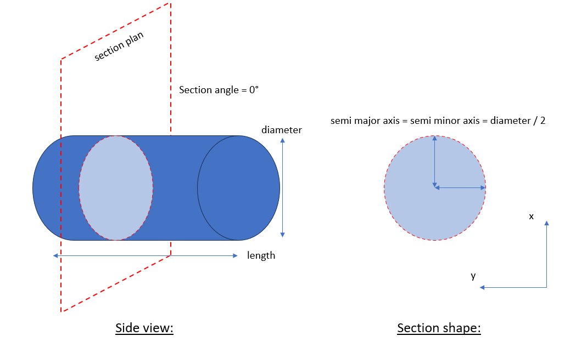
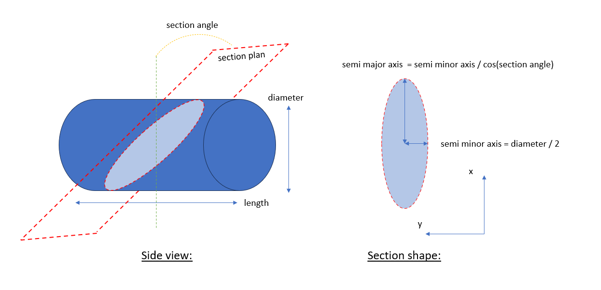
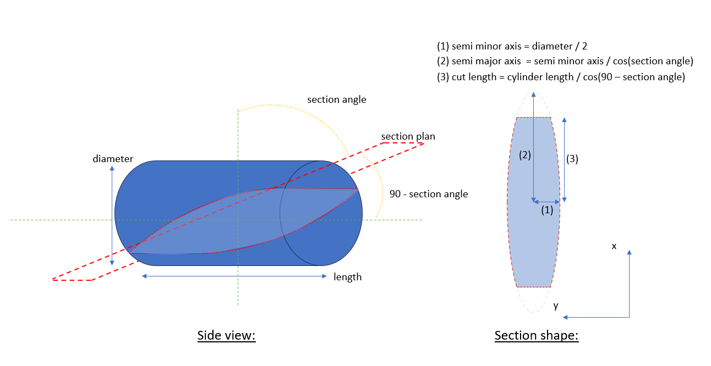
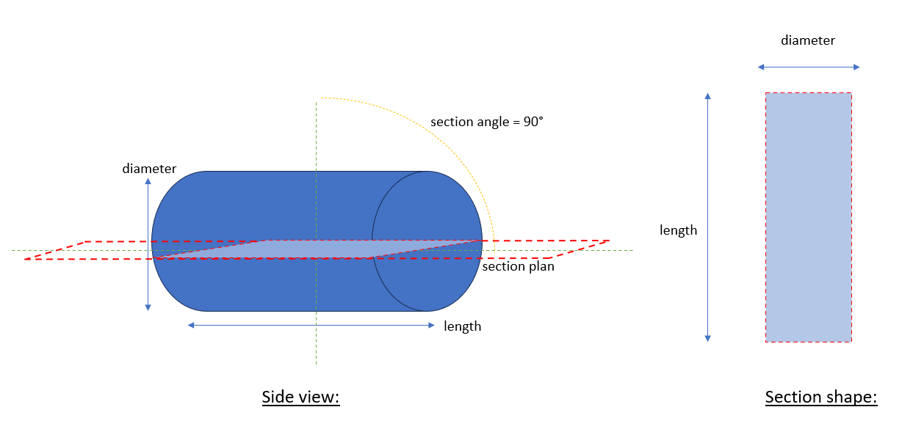

# Cylinder section calculator

This tool purpose is to allow to visualize the section shape of a cylinder according to the section angle.

## Section shapes:

Four shapes of section can be found:

### Case 1: circle shape

#### Explaination:

The section angle is 0°, the cut is perpendicular to the length of the cylinder.
The section shape is then the same as the cylinder base:

The curve() function from Cylinder() object is used with semi_minor_axis = semi_major_axis = diameter / 2.

#### Interface:

### Case 2: ellipse shape

#### Explaination: 

The section angle is superior to 0°, the cut is made before the cylinder base.
The section shape is then an ellipse with a semi_minor_axis equal to diameter/2:

The curve() function from Cylinder() object is used with the relations mentionned above.
This is performed with the ellipse_eq() function of Cylinder() object.

#### Interface:

### Case 3: truncated ellipse shape

#### Explaination: 

The section angle is superior to 0°, the cut is made after and intercept the cylinder base.
The section shape is then an ellipse truncated by each cylinder base:

The curve() function from Cylinder() object is used between each vertex following axis x, vertex are linked by a straight line following axis y. This is performed with the trunc_ellipse_eq() function of Cylinder() object.

#### Interface:

### Case 4: rectangle shape

#### Explaination:

The section angle is 90°, the cut is parallel to the length of the cylinder.
The section shape is then a rectangle with width = diameter and length = cylinder length:

The vertexes are directly linked together with the rectangle_eq() function of Cylinder() object.

#### Interface:

